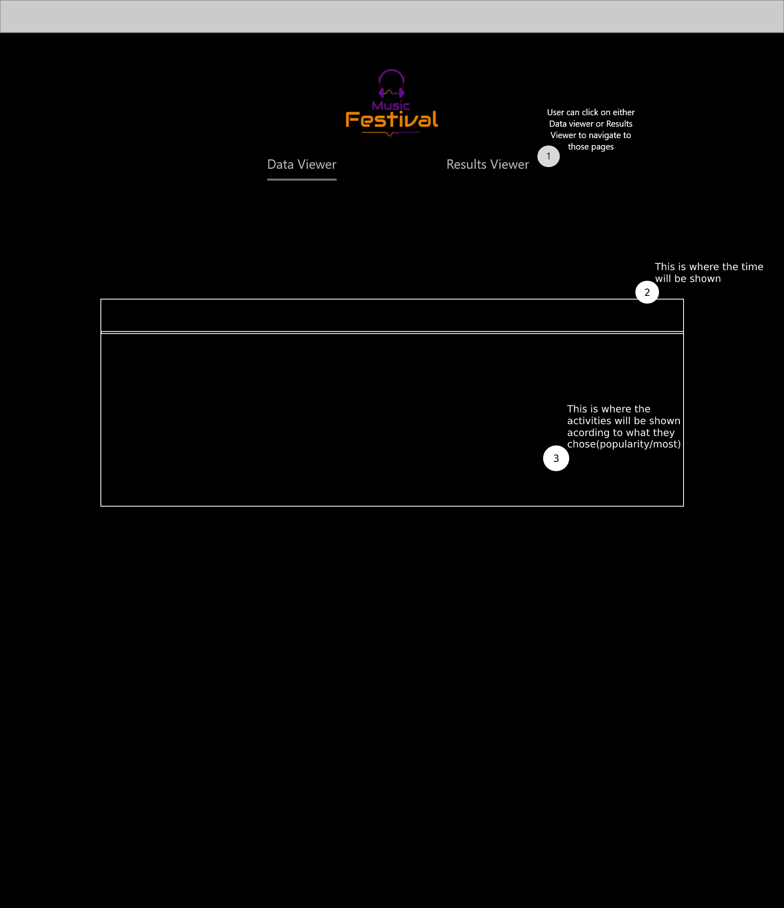
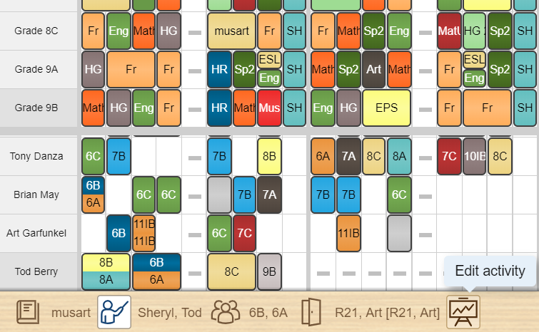
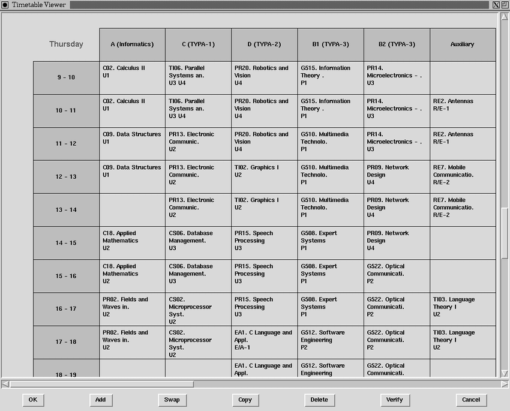

# Wireframe & Justification

This document should help you explain how your user interfaces are designed. You should have a wireframe to give a good overview and some screenshot with simple writeups to justify your designs.

## Wireframe

> This is just an example, please find your own wireframe.

## Justifications

### Justification 1

> This is just an example, please find your own justifications.

#### Good Points

1. Nice looking UI.
2. Show data with start/end time appropriately.

#### Bad Points

1. Controls may not be relevent, need to redesign the controls.
2. May be hard to implement.

### Justification 2

#### Good Points

1. Simple looking UI.
2. Show data with start/end time appropriately.

#### Bad Points

1. It looks too crowded may be hard for user to understand the timetable.
2. May be hard to implement.

### Justification 3

#### Good Points

1. Very clean and simple UI.
2. Show data with start/end time appropriately.

#### Bad Points

1. Looks too simple, might not be to peoples liking.
2. May be hard to implement.
