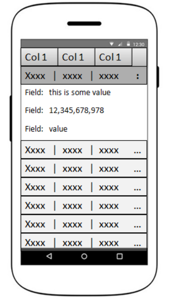

# Wireframe & Justification

## Wireframe

## Justifications

### Justification 1

##### Source: https://datatables.net/extensions/fixedheader/examples/integration/responsive-bootstrap.html

#### Good Points

1. Extra details or details that couldn't fit into the constraints of the screen are collapsed. A button is visible for the user to press on to reveal the contents.
2. Pressing on the columns will sort that particular column by ascending/descending order.
3. Pagination shows the total number of entries as well as the current rows of entries displayed.
4. Simple design and is not confusing.

#### Bad Points

1. Single search filter, more search bars will be needed to filter more attributes.
2. Hard to jump pages, if the database is large, it would be better to allow the user to jump to specific pages of their choice.

### Justification 2

#### Good Points

1. Although the example shown is for iPad. It can also be applied to mobile screens as well
2. The user can input multiple search fields within 1 search bar, seperating different filter attributes by putting a space in between the attributes. For example
   if the user wants to filter by specific columns like handphone no. and name, they can just input into the filter box the following for example "12345678 Alex". Good way to save space on the page

#### Bad Points

1. Not easily customizable
2. No pagination, user will have to scroll down.

### Justification 3

#### Good Points

1. Easily readable/Simple UI
2. Easily customizable

#### Bad Points

1. Have to click on each and individual row to be able to view the data
2. No pagination, user will have to scroll down
3. No filter, will be hard to find the data the user needs/require
